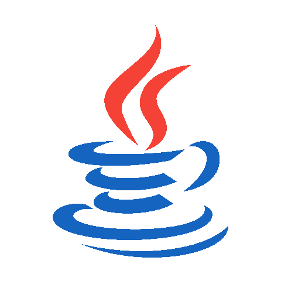

<picture>
  
</picture>

## About me

<picture>
  
</picture>
  

- 🎓 Soy estudiante de **Ingeniería Telemática**, en la Universida Distrital. 
- 💻 Desarrollo aplicaciones y sitios web enfocados en brindar una excelente experiencia de usuario.  
- 📊 Experiencia en **visualización y análisis de datos**  
- 🚀 Apasionada por la tecnología y en constante aprendizaje.
- 🌐 [Mi sitio web](https://cutt.ly/Sofia_Salamanca_Website)
  
---

---

## <picture></picture>  Skills

### <picture></picture> Programming Languages
Java • Python • JavaScript • C • C++ 

### <picture></picture> Frontend
HTML • CSS • JS • Bootstrap

### <picture></picture> Tools & IDEs
Git • GitHub • JSON • Selenium • MySQL • Django • LaTeX • VS Code • JetBrains • Eclipse • Atom

---

## Connect with me

  <a href="salobando2023@gmail.com">Gmail</a> •
  <a href="https://github.com/salobando">GitHub</a> •
  <a href="https://wa.me/3008833628">WhatsApp</a> •
  <a href="www.linkedin.com/in/danna-sofia-salamanca-obando-desarrolladora-fullstack">LinkedIn</a>

