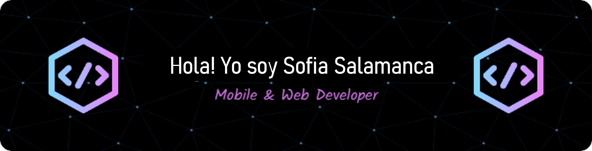

<picture>
  
</picture>

<picture>
  
</picture>

## About me

<picture>
  
</picture>

 
- 🎓 Soy estudiante de **Ingeniería Telemática**, en la Universida Distrital. 
- 💻 Desarrollo aplicaciones y sitios web enfocados en brindar una excelente experiencia de usuario.  
- 📊 Experiencia en **visualización y análisis de datos**  
- 🚀 Apasionada por la tecnología y en constante aprendizaje.
- 🌐 [Mi sitio web](https://cutt.ly/Sofia_Salamanca_Website)
 
---

---

## <picture></picture>Skills

### Programming Languages
C • C++ • Java • Python • JavaScript

### Frontend
HTML • CSS • React • JS

### Tools
Git • GitHub • JSON • Selenium • MySQL • Django • LaTeX

### IDEs
VS Code • JetBrains • Eclipse • Atom

---

## Connect with me

  <a href="mailto:ahmed.7oskaa@gmail.com">Gmail</a> •
  <a href="https://github.com/7oSkaaa">GitHub</a> •
  <a href="https://wa.me/0201208822340">WhatsApp</a> •
  <a href="https://www.linkedin.com/in/7oskaa/">LinkedIn</a>

